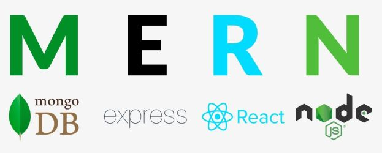

  
  
  

<!-- PROJECT LOGO -->
 

  

<h3 align="center">Jornada Fullstack</h3>
<h4><i>Samsung Ocean</i></h4>

  

    Nessa Jornada você terá a oportunidade de aprender backend e frontend e colocar os conhecimentos em prática em um projeto completo que será desenvolvido ao longo das 8 aulas!
  

<!-- ABOUT THE PROJECT -->

## Ementa do Curso

Entenda de uma vez por todas o que é backend e quais são as tecnologias envolvidas nesse pedaço tão importante de um software, responsável pela maior parte do processamento de informações e por proteger a camada de banco de dados da aplicação. Você entenderá desde os princípios do backend, tendo uma introdução completa sobre o assunto e começará a dar os primeiros passos desenvolvendo uma aplicação em `NodeJS`, com a linguagem de programação `JavaScript`.

## Cronograma das Aulas

- **09/08/2022:** Backend com `NodeJs` e `Express` (Parte 1)
- **11/08/2022:** Backend com `NodeJs` e `Express` (Parte 2)
- **16/08/2022:** Laboratório de Backend com Banco de Dados e `MongoDB`
- **18/08/2022:** Integrando os serviços de backend na nuvem
- **22/08/2022:** Frontend Web com `ReactJS`: Introdução (Parte 1)
- **23/08/2022:** Frontend Web com `ReactJS`: Introdução (Parte 2)
- **31/08/2022:** Frontend Web com `ReactJS`: Integração com Backend (Parte 1)
- **01/09/2022:** Frontend Web com `ReactJS`: Integração com Backend (Parte 2)

## Tópicos

- O que exatamente é backend?
- Evolução do backend
- REST (Verbos de comunicação: GET, POST, PUT, DELETE)
- JSON
- Postman (criando/fazendo requisições e organizando em collections)
- JSON Viewer
- JavaScript: do frontend para o backend
- NodeJS
- Package JSON
- NPM (Node Package Manager)
- Benchmarking
- Criação do projeto
- Início do desenvolvimento da aplicação CRUD
  - Create, Read (All/Single), Update & Delete
  - Criar, Ler (tudo ou individual), Atualizar e Remover
- Node Express
- Body-Parser

## Outras Informações

- **Público Alvo:** Estudantes, Profissionais, interessados em geral.
- **Pré-Requisitos:** Acima de 13 anos.
- **Duração:** 3 horas cada encontro
- **Palestrante:** [Prof. Paulo Salvatore](https://github.com/paulosalvatore)

## Conheça o Samsung Ocean

O [Samsung Ocean](https://oceanbrasil.com/) é uma iniciativa da Samsung no Brasil que oferece capacitação tecnológica à comunidade e fomenta a criação de empresas de base tecnológica (startups). Com instalações modernas, o programa oferece gratuitamente treinamentos técnicos combinados com temas relacionados à usabilidade e ao empreendedorismo, além do contato com especialistas da empresa e do mercado.

## Licença

Distributed under the MIT License. See `LICENSE.txt` for more information.
